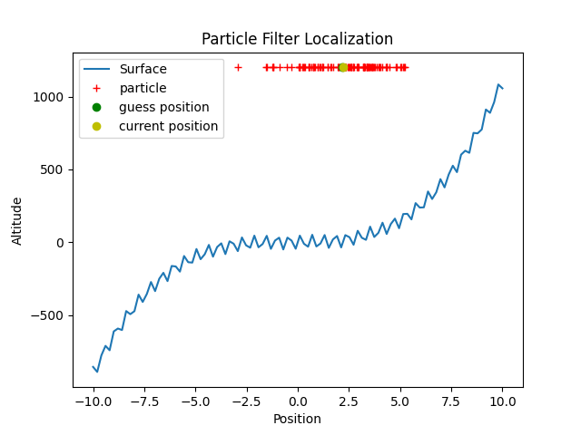

# Basic Particle Filter for Localization
## Introduction
This program create for education about particle filter localization in simply concept.

Assume aircraft is flying on somewhere that we unknow position of aircraft but aircraft 
can observe altitude of aircraft from ground surface and we have map of this area that aircraft is flying. 
We will use particle filter to localization position of aircraft.

## Setting Parameter
|Name|Description|Default|
|---|---|---|
|n_particles |Number of particle| 100|
|lower_bound |Lower bound of Area|-10 |
|upper_bound |Upper bound of Area|10|
|position_aircraft |Initial position of Aircreaft |-9| 
|n |Number of interval in Area |100|  
|number_per_step |Number of Stepsize to move |5| 
|altitude_of_aircraft_from_sea_level |Altitude of Aircraft from sea level | 1200|
|sigma_of_moving |Standard Deviation of moving Aircraft |0.5|
|sigma_of_observing |Standard Deviation of observing|30|
|sigma_of_resample_position_particles |Standard Deviation of resampling | 0.5|
|number_operate |Number of loop that Operate|10|

## Blog
* Medium (Thai language) : [https://medium.com/@piyasakchai.sattrupinat.ps/particle-filter-for-localization-ตัวกรองอนุภาคสำหรับการระบุตำแหน่ง-dd1e4821001a](https://medium.com/@piyasakchai.sattrupinat.ps/particle-filter-for-localization-ตัวกรองอนุภาคสำหรับการระบุตำแหน่ง-dd1e4821001a)